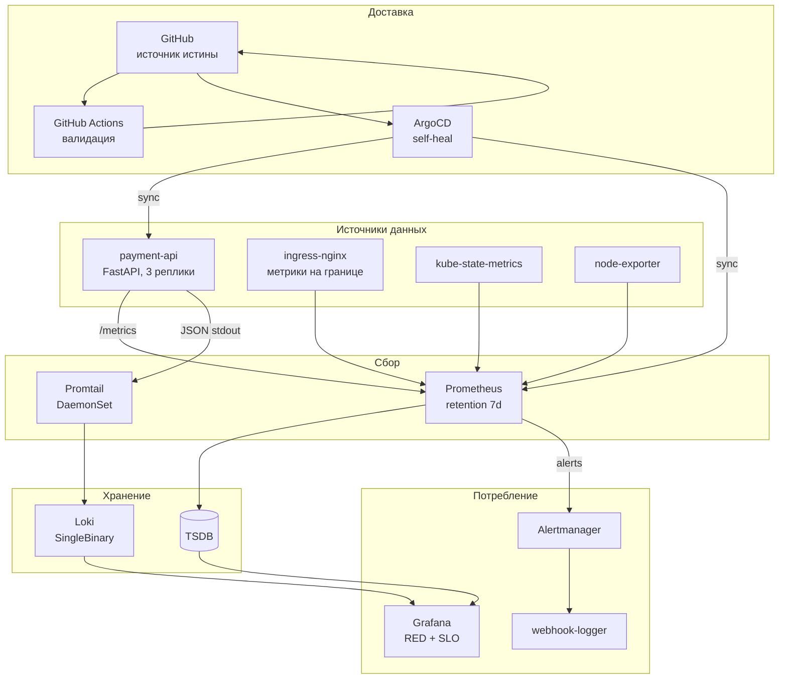

# obs-platform

Production-подобная платформа наблюдаемости на Kubernetes: метрики, логи, алертинг,
SLI/SLO с бюджетом ошибок, GitOps-доставка и CI-валидация конфигураций.

Проект построен вокруг реального сценария: платёжный сервис в банке, который нужно
наблюдать, диагностировать и защищать от деградаций. Каждое техническое решение
сопровождается обоснованием — почему сделано так, а не иначе.

---

## Стек

| Слой | Технологии |
|---|---|
| Оркестрация | Kubernetes (k3s в k3d), ingress-nginx |
| Метрики | Prometheus Operator, kube-state-metrics, node-exporter |
| Логи | Loki, Promtail |
| Визуализация | Grafana (дашборды как код через provisioning) |
| Алертинг | Alertmanager: маршрутизация, группировка, inhibition, silence |
| GitOps | ArgoCD с self-heal |
| CI | GitHub Actions: yamllint, kubeconform, promtool check + unit-тесты |
| IaC | Terraform (Helm-релизы), Ansible (подготовка окружения) |
| Приложение | FastAPI с инструментированием и управляемым хаосом |

---

## Архитектура



**Ключевая идея:** git — единственный источник истины. Изменения проходят через PR
с обязательной валидацией, ArgoCD приводит кластер к описанному состоянию
и возвращает ручные правки за ~15 секунд.

---

## Быстрый старт

```bash
# 1. Подготовка окружения и кластера
cd ansible && ansible-playbook playbook.yml

# 2. Стек наблюдаемости
cd ../terraform
export TF_VAR_grafana_admin_password='ваш_пароль'
terraform init && terraform apply

# 3. Приложение и конфигурация — через ArgoCD
kubectl apply -f monitoring/argocd/
```

Домен `localtest.me` резолвится в 127.0.0.1 — правка `/etc/hosts` не требуется.

| Сервис | URL |
|---|---|
| Grafana | http://grafana.localtest.me:8080 |
| Prometheus | http://prometheus.localtest.me:8080 |
| Alertmanager | http://alerts.localtest.me:8080 |
| ArgoCD | http://argocd.localtest.me:8080 |
| payment-api | http://payment.localtest.me:8080 |

---

## Что демонстрирует проект

### SLI / SLO / Error Budget

Определены два SLI с явными границами: что считается валидным запросом
(health-чеки исключены), что считается успешным (5xx — отказ, 4xx — ошибка клиента).

```promql
sli:payment_api_availability:ratio_rate1h
  = sum(rate(http_requests_total{path!~"/healthz|/readyz", status!~"5.."}[1h]))
  / sum(rate(http_requests_total{path!~"/healthz|/readyz"}[1h]))
```

SLO 99.5% за 30 дней → бюджет ошибок 0.5% → 3 часа 39 минут простоя в месяц.

**Multi-window multi-burn-rate алерты** вместо фиксированных порогов:

| Severity | Burn rate | Окна | Бюджет сгорит за | Реакция |
|---|---|---|---|---|
| critical | 14.4 | 1h + 5m | ~2 дня | разбудить |
| critical | 6 | 6h + 30m | ~5 дней | разбудить |
| warning | 3 | 6h | ~10 дней | задача |

Почему так лучше порога: всплеск 90% ошибок на минуту почти не тратит месячный
бюджет — будить некого. А ползучие 1% в течение недели порог никогда не поймает,
хотя треть бюджета сгорит.

📄 [Конспект по SLO](docs/notes-shift-06-slo.md) ·
[Правила](monitoring/prometheus/rules/payment-api-slo.yaml)

### Трёхуровневый алертинг

| Уровень | Кто реагирует | Примеры |
|---|---|---|
| **page** (critical) | дежурный немедленно | сервис недоступен, бюджет горит быстро |
| **ticket** (warning) | команда в рабочее время | OOMKilled, застрявший выкат, память у лимита |
| **info** | материал для трендов | короткие всплески ошибок |

Разделение появилось не из теории, а из [разбора инцидента](docs/postmortems/2026-08-16-payment-api-memory-limit.md):
поды падали в CrashLoopBackOff, деплой был заблокирован — и **ни один алерт не сработал**,
потому что все правила смотрели на симптомы пользователя, а пользователь не пострадал.

### Корреляция метрик и логов

С панели Error Ratio один клик ведёт в Loki с уже подставленным запросом
и тем же временным диапазоном:

```logql
{namespace="banking", app="payment-api"} | json | status >= 500
```

Метрика показывает **что** происходит, лог — **почему**. Пример из практики:
при 30% ошибок латентность на дашборде не изменилась. Логи показали
`duration_ms: 1.02` — сервис отдавал 500 мгновенно, не выполняя работу.
Быстрый отказ не растит латентность.

### Runbook'и, привязанные к системе

Не «проверьте логи и метрики», а готовые к копированию команды с конкретными
namespace и именами сервисов, таблицами переходов и явными критериями эскалации.

📄 [PaymentApiDown](docs/runbooks/payment-api-down.md) ·
[PaymentApiHighErrorRate](docs/runbooks/payment-api-errors.md)

Ссылки на runbook'и приходят в самом уведомлении через `runbook_url` в аннотациях.

### CI, который ловит реальные ошибки

```
yamllint          → синтаксис и единый стиль
kubeconform       → соответствие манифестов схемам Kubernetes
promtool check    → корректность правил Prometheus
promtool test     → unit-тесты алертов: сработает ли правило на заданных данных
jq                → валидность дашбордов + запрет волатильных полей
```

Пайплайн поймал ошибку `for: 0.5m` — Prometheus не понимает дробные длительности.
Манифест применился бы без ошибки, но группа из четырёх алертов,
включая `PaymentApiDown`, не загрузилась бы. Обнаружилось бы во время аварии.

Unit-тест алерта проверяет не синтаксис, а логику:

```yaml
input_series:
  - series: 'up{job="payment-api"}'
    values: '1x10 0x20'      # 10 интервалов жив, потом мёртв
alert_rule_test:
  - eval_time: 4m
    exp_alerts: []           # ещё рано, for не прошёл
  - eval_time: 8m
    exp_alerts: [...]        # должен сработать
```

📄 [Workflow](.github/workflows/validate.yml) · [Тесты](tests/)

### GitOps и защита от дрейфа

ArgoCD с `selfHeal: true` сравнивает кластер с git и возвращает ручные изменения.
Проверено экспериментально: `kubectl patch` с изменением лимитов памяти
откатывается за **14 секунд**.

Это прямое следствие постмортема — системной причиной инцидента было отсутствие
технического барьера между ручным изменением и продом.

Прямой push в `main` запрещён правилом репозитория, изменения только через PR
с четырьмя обязательными проверками.

---

## Структура репозитория

```
apps/payment-api/          FastAPI: RED-метрики, бизнес-метрики, JSON-логи, хаос-ручки
apps/loadgen/              генератор фонового трафика
monitoring/
  prometheus/rules/        алерты, SLO recording rules, диагностические правила
  grafana/                 дашборды как ConfigMap
  loki/  promtail/         сбор и хранение логов
  alertmanager/            приёмник уведомлений
  argocd/                  Application-манифесты
  kustomization.yaml       сборка конфигурации мониторинга
dashboards/                JSON дашбордов (источник для ConfigMap)
terraform/                 Helm-релизы с фиксированными версиями
ansible/                   подготовка окружения: пакеты, Docker, k8s-инструменты, кластер
clusters/                  конфигурация кластера k3d
tests/                     unit-тесты правил Prometheus
docs/
  runbooks/                инструкции по реагированию на алерты
  postmortems/             разборы инцидентов
  notes-shift-*.md         конспекты по темам
.github/workflows/         CI
```

---

## Инженерные решения и их обоснование

**Кардинальность метрик.** В лейблах только низкокардинальные значения:
`method`, `path` (шаблон роута, не конкретный URL), `status`. `trace_id`,
`account_id`, `payment_id` — в теле лога, но не в лейблах. Каждая уникальная
комбинация лейблов создаёт отдельный временной ряд; `trace_id` в лейбле
означает ряд на каждый запрос.

**Корзины гистограмм под целевой SLO.** SLI по латентности считается как доля
запросов быстрее порога, а доля берётся из счётчика конкретной корзины —
интерполяции здесь нет. Нет корзины с нужной границей → SLO не измерить.
Отсюда: сначала целевое значение, потом набор корзин.

**Liveness ≠ readiness.** `/healthz` намеренно не учитывает состояние зависимостей,
`/readyz` учитывает. Иначе проблема у соседнего сервиса вызовет бесконечный
перезапуск здоровых подов.

**Технические и бизнесовые метрики.** `http_requests_total` скажет, что сервис
отвечает 200. `payments_total` скажет, идут ли деньги. Сервис может отвечать 200
и не проводить ни одного платежа — например, при отказе внешнего провайдера.

**Измерение SLI на границе.** Метрики приложения не покажут запросы, оборвавшиеся
вместе с процессом — писать метрику некому. Метрики ingress-nginx зафиксируют 502.
Для SLI честнее точка измерения ближе к пользователю.

**Дашборды как код.** JSON в git → ConfigMap → sidecar Grafana. Provisioned-дашборды
нельзя править через UI — это не ограничение, а смысл подхода: источник истины git,
а не база Grafana, которая по умолчанию живёт в `emptyDir` и исчезает вместе с подом.

---

## Разобранные инциденты

**[Занижение лимита памяти](docs/postmortems/2026-08-16-payment-api-memory-limit.md)** —
латентный сбой: поды в CrashLoopBackOff, деплой заблокирован, пользователи
не затронуты, мониторинг молчит. Привёл к появлению диагностического слоя алертов
и внедрению GitOps.

**Коллизия лейблов.** Приложение отдавало лейбл `endpoint`, Prometheus
перезаписывал его именем порта из Service. Исходное значение сохранялось
как `exported_endpoint`. Решение — переименование лейбла в приложении
(`endpoint` → `path`), а не отключение защиты через `honorLabels`.

**Недостоверная метрика.** Алерт `AlertmanagerClusterCrashlooping` горел постоянно
при нулевых рестартах. Разбор: `changes()` считает изменения значения, а не рестарты;
`process_start_time_seconds` дрейфовала со скоростью ~2% из-за расхождения часов
в WSL2. Метрика формально доступна, но недостоверна.

---

## Что дальше

- [ ] PostgreSQL и Kafka как зависимости сервиса — новые сценарии инцидентов
- [ ] Alloy вместо Promtail (Promtail в режиме поддержки)
- [ ] OpenTelemetry и распределённая трассировка
- [ ] Секреты через External Secrets Operator или SOPS
- [ ] NetworkPolicy и RBAC-ограничения
- [ ] Эфемерный кластер в CI для проверки применимости манифестов

---

*Автор: [Doniyor Boborakhimov](https://github.com/DoniyorBoborakhimov)*
